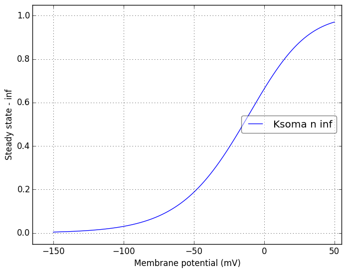

Channel information
===================
    

Channel information at: T = 24.0 degC, E_rev = 0 mV, [Ca2+] = 5e-05 mM

<table>
    <tr>
<td width="200px">
            <b>Nasoma</b> 
            <a href="../Nasoma.channel.nml">Nasoma.channel.nml</a> 
            <b>Ion: na</b> 
            <i>g = gmax m_inf3 * h </i> 
            Na+ current
            reference of the original .mod file: Martina, Jonas (1997); Martina, Vilda, Jonas (2000)
</td>
<td>

</td>
<td>

</td>
</tr>
    <tr>
<td width="200px">
            <b>Nadend</b> 
            <a href="../Nadend.channel.nml">Nadend.channel.nml</a> 
            <b>Ion: na</b> 
            <i>g = gmax * m_inf3 * h </i> 
            Na+ current
            reference of the original .mod file: Martina, Jonas (1997); Martina, Vilda, Jonas (2000)
</td>
<td>

</td>
<td>

</td>
</tr>
    <tr>
<td width="200px">
            <b>Ksoma</b> 
            <a href="../Ksoma.channel.nml">Ksoma.channel.nml</a> 
            <b>Ion: k</b> 
            <i>g = gmax * n4 </i> 
            K+ current 
</td>
<td>

</td>
<td>

</td>
</tr>
    <tr>
<td width="200px">
            <b>Kdend</b> 
            <a href="../Kdend.channel.nml">Kdend.channel.nml</a> 
            <b>Ion: k</b> 
            <i>g = gmax * n4 </i> 
            K+ current 
</td>
<td>

</td>
<td>

</td>
</tr>
    <tr>
<td width="200px">
            <b>IA</b> 
            <a href="../IA.channel.nml">IA.channel.nml</a> 
            <b>Ion: k</b> 
            <i>g = gmax * a * b </i> 
            K+ current 
            reference: Warman (1994); Zhang McBain (1995); Martina (1998) 

</td>
<td>

</td>
<td>

</td>
</tr>
    <tr>
<td width="200px">
            <b>Ih</b> 
            <a href="../Ih.channel.nml">Ih.channel.nml</a> 
            <b>Ion: h</b> 
            <i>g = gmax * r </i> 
            Hyperpolarization activated non-specific cation current
            (contributes to the resting potential, controls the afterhyperpolarization)
            reference: Maccaferri et al. (1993); Maccaferri and McBain (1996); Pape (1996); Magee (1998)
            
</td>
<td>

</td>
<td>

</td>
</tr>
</table>

